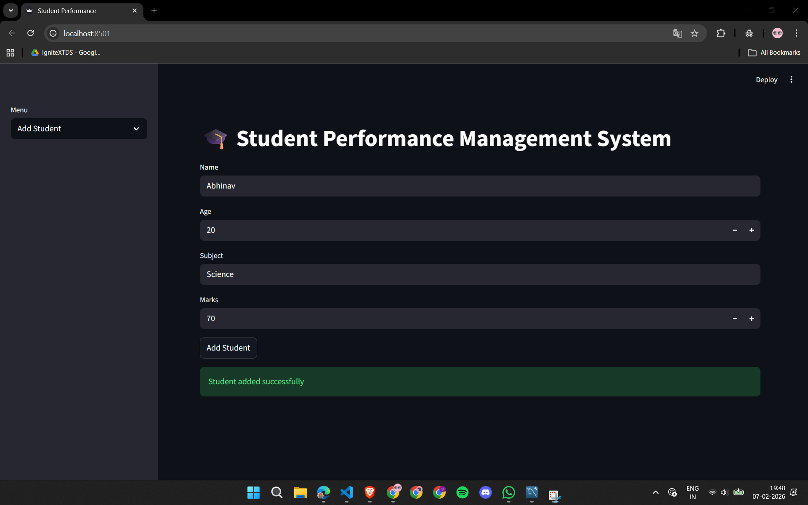
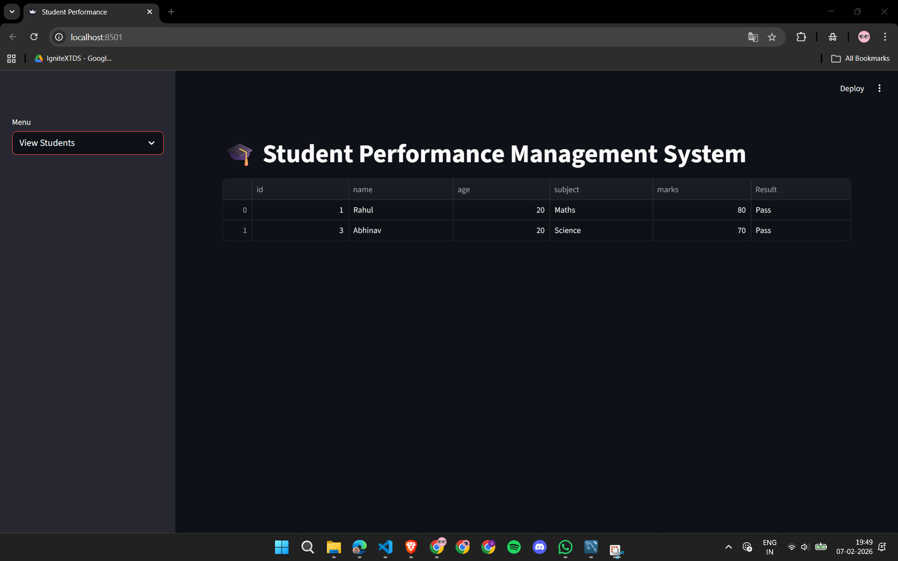
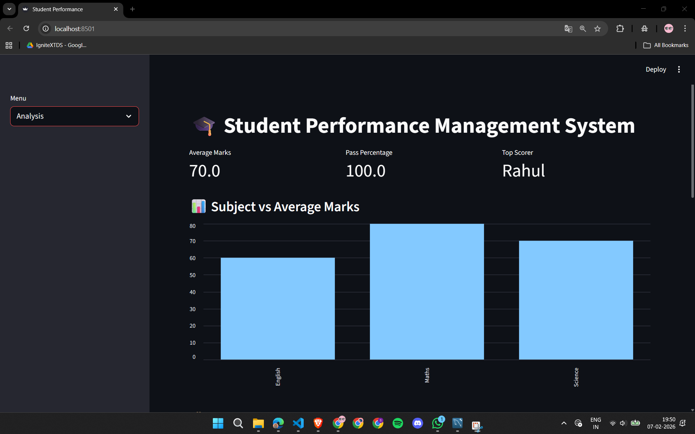

# 🎓 Student Performance Management System

A web-based application built using **Streamlit + MySQL** to manage and analyze student performance data.

## 🔧 Tech Stack
- Frontend: Streamlit
- Backend: Python
- Database: MySQL
- Libraries: pandas, mysql-connector-python, matplotlib

## ✨ Features
- Add, view, update, and delete student records
- Pass/Fail status calculation
- Subject-wise average marks
- Pass percentage & top scorer analysis
- Interactive charts

## 🗄 Database Schema
students(id, name, age, subject, marks)

## ▶ How to Run
```bash
pip install -r requirements.txt
streamlit run app.py


## 📸 Screenshots

### ➕ Add Student


### 📋 View Students



### 📊 Analysis Dashboard



